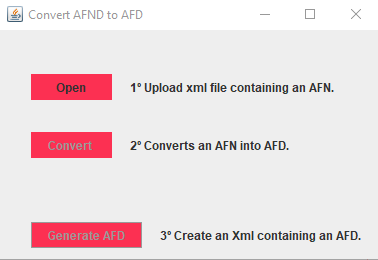

# Convert AFND to AFD

AFN to AFD conversion program. This application was written using the Java language, where the tool can load an XML type file created in the tool: JFlap, containing an AFND(Non-Deterministic Finite Automaton). This way, the tool will convert AFND (Finite Non Deterministic Automaton) to an AFD (Finite Deterministic Automaton), and after the conversion, an output XML file containing the converted automaton is generated.

